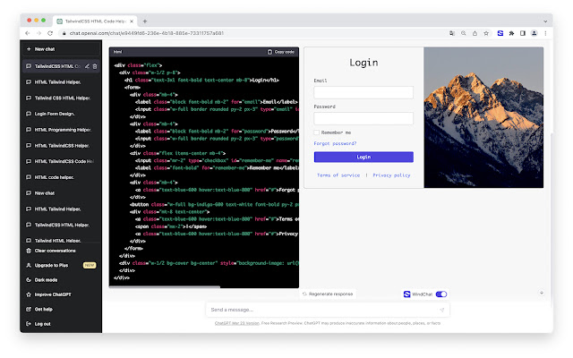

# Demo


# source code
https://github.com/WooodHead/vscode-wrap-console-log-simple

# original project
https://github.com/midnightsyntax/vscode-wrap-console-log

# Features

This extension read the word under your cursor and insert a statement with the word:

```
cmd + E: console.log('variable', variable);

> New feature: print multiple variables
aaa,bbb,ccc
console.log('aaa', aaa);
console.log('bbb', bbb);
console.log('ccc', ccc);

alt + E: console.log('variable');

alt + A: new line;

alt + W: // comment line

cmd + J: console.log('variable', JSON.stringify(variable, null, 2));

alt + G: console.log('\n%c--------- variable --------- \n', 'background:yellow; color:blue; font-weight:600;');

alt + T: expect(variable).toBeDefined();


```

In settings, replace `console.log` with your own function name,
example:

```
Wrap-console-log-simple: Function Name

debug
```

will output
```
debug('variable');
debug('variable', variable);
```

# WindChat - ChatGPT TailwindCSS HTML Previewer

https://chrome.google.com/webstore/devconsole/bc648ec4-1675-45f6-96a6-93ec942c93ec/ipafbgdehdljgphjgfmpkohhbelebdhm/analytics/impressions




# CodeXP.link
Search in 180M open source javascript projects.

https://codexp.link


